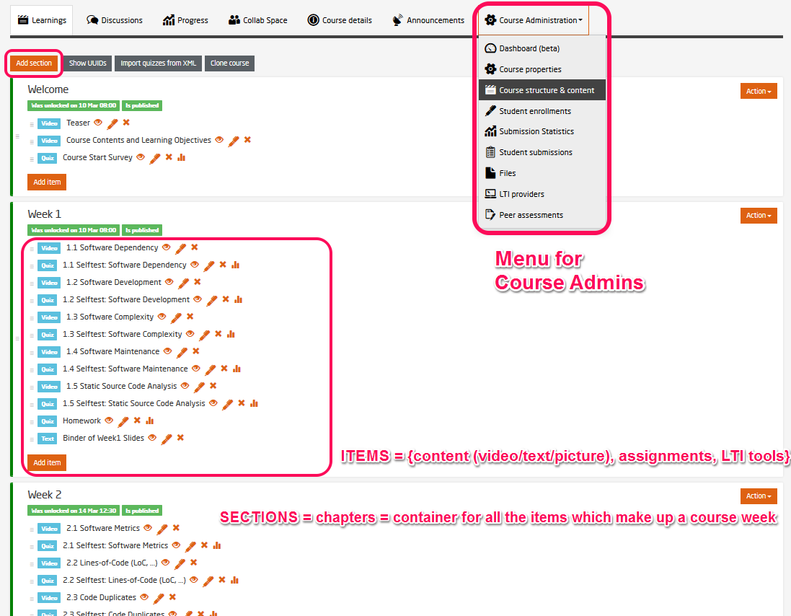
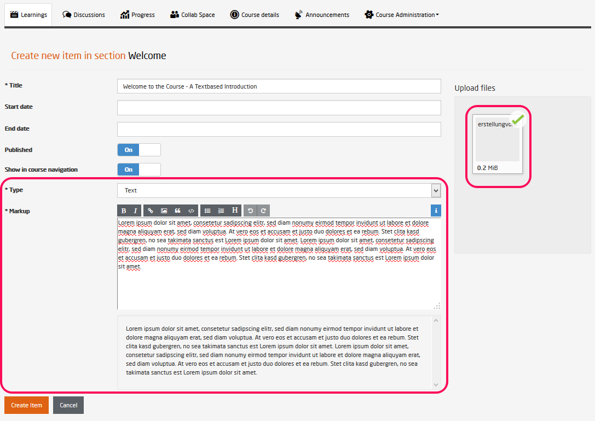
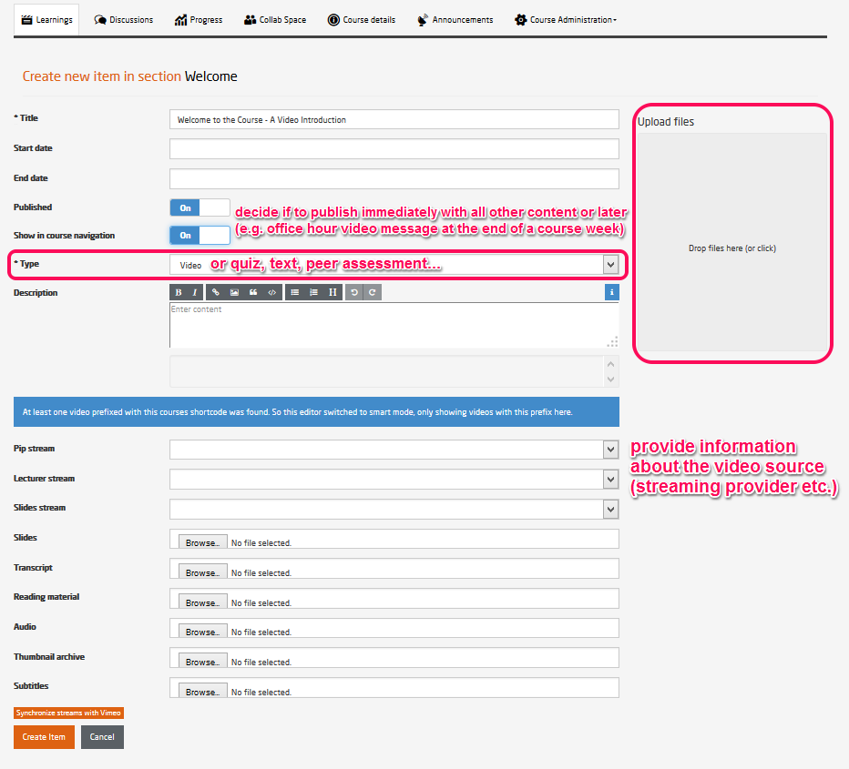
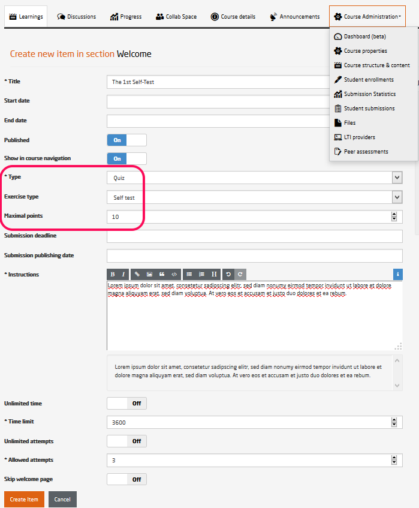

## Adding your content to the platform ##

### Preparation of course materials ###

We recommend to start with the preparation of the course materials at minimum 2 months before course start.

 The first task here is the design of the course outline.
 
###Recording of lecture videos in the studio###
 
Tips from the camera crew:

-	Please start recordings well prepared. Slides should be prepared, if required talk them through.
-	Because of green screen background, please refrain from wearing green attire.
-	Please avoid finely checked clothing as they are not desirable for video recordings either.
-	Please look after your appearance, it should be well-groomed (keep in mind that several thousand people will watch your style.)
-	Due to the studio lights it can become quite warm in the recording room. 

 
###PR – Video – Course Introduction###

It has proven in the past, that it makes sense to create a short video teaser, (apart from the course introduction video) This short teaser video shouldn’t have a duration of more than 2 minutes. The teaser is used for marketing purposes. The course introduction video gives a more detailed overview of course content and structure and perhaps the typical course cycle.
Both videos should be published on YouTube or a similar platform. They should be linked to the course details page.
The Youtube links should also be provided to your PR department.

###Teaching-Team – Person in charge as per week###

We recommend to choose one member of the teaching team as the person in charge for each week prior to course start. 

This person’s tasks are the first outline of the weekly content. (concrete: Quizzes, Homework, Reading Material) as well as:

- Organisation of content creation (e.g. timely recording and post production of videos, preparation of reading materials, etc.)
- Preparation and moderation of editorial meetings for the particular course week
- Approval of weekly platform content as well as coordination of quality assurance
- Coordination of fora and support during the course week (together with team leader)
This approach and procedure is not mandatory but it has proven worth in the past. 

###Setting the Course Content on the Platform###

It is advisable to keep the surface of the course website clean and comprehensible for the learners.

####Course Structure####

Each course consists of several modules or sections. In general these modules comprise 1 week of the course. They can, however, have arbitrary names and are not necessarily restricted to last exactly one week. A typical 6 week course structure could look like this:

- Welcome
- Week 1
- Week 2
- Week 3
- Week 4
- Excursion
- Week 5
- Week 6
- Final Exam
- Survey

The platform team will create the course for you. Fill it with content.

#####Add Section#####

- Course administration → Course Structure and content.
- *Add Section*: 
	- A section generally contains a course week. It can also contain special purpose content, such as a Final Exam, an Excursion, or a Survey.

	TODO: Screen shot

- *Add Item*: An Item can be a text, video, quiz or an external LTI tool which connects to the platform.
- Important: When creating Items, DO NOT set an end date.
- Survey – Course beginning and end (set by the openHPI team)
- I like/ wish (set by the platform team)

#### Reading Material ####

The provision of reading material can be generally carried out in three forms: 

 - as a Text-page, 
 - as a PDF download, or 
 - as a Web link

Downloads can be provided directly through the platform. In those regions of the platform where this possibility exists, you will find a data upload field for this purpose.

#### Videos ####

>The workflow of video production and post production, in terms of allocation of videos, can be carried out in different ways and therefore will not be discussed further in this document. Instead, we assume that you already have a produced video at hand, which you want to bring to the platform.

*Also note: This section is openHPI specific in that openHPI uses Vimeo as an external video hosting platform which might not be necessarily valid for e.g. MOOC.house.*

Basically there is a Vimeo Pro account that exists for openHPI, from which Videos are delivered.
Finished videos will be uploaded to Vimeo by the media technology department. The filenames of the videos should begin with the course's course_code, thereby the positioning of the videos on the openHPI web surface will be substantially simplified. Please note that the system operates case sensitive here. After the upload of the videos, openHPI has to be synchronized with the Vimeo account. A button for the purpose exists on the administration surface of openHPI.

After the successful conversion, the Teaching Team must carry out a short quality assurance:

 - Do the videos match the file names?
 - Are the titles and lecturers spelled correctly in the PIP-Videos?

Besides that, the configuration parameters (at least in the beginning) of the Videos must be monitored (for this, see “openHPI Vimeo-Settings”).

**The following must be considered during the integration of the videos:**

All videos can be integrated via a dropdown menu directly using the Vimeo API. In case the appropriate videos are named according to the specification above (name begins with abbreviation), only the course relevant videos will be listed in the dropdown menu. Videos that are not named in respect to this convention will not be listed. openHPI must be synchronized with Vimeo once again, when a videos title has been changed there.

 - The steps listed above must be executed for the PIP stream (Picture in Picture) as well as the teacher and desktop stream, should all possibilities be offered.

Additional information (I.e introductory remarks or Errata) can be inserted above or below the video during the preparation and editing, respectively, of video items in openHPI. 

 - Mentioned aboved steps need to be carried out into account not only fort he PIP stream (Picture in Picture) but also for the Teacher and Desktop Stream in case all choices should be offered.

When implementing video items on the openHPI Platform additional further information (such as introductory remarks or errata) can be added to the video on top or below the video items.

Complementary course slides (lecturer slides) or audio file or transcripts can be uploaded complementary to the video.

For the Thumbnail navigation thumbnails need to be created via thumbnail generator.
[http://fb10mas01:81/]()  ([openhpi@hpi.de/openhpi]()) (contact person Dr. Haojin Yang) Those created thumbnail archives are added to the particular video in the admin interface.

#### Slides ####

The slide sets can be provided as a PDF download, just like normal reading material. Slides to the videos should be added directly to the video item. Collected slide sets additionally can be made available to download on the 'materials' web page. For mobile apps, only the slides that have been provided with the video item will be included.

#### Audio ####

For the optional provision of separate audio tracks for the videos, the same channels as have been introduced for the reading materials can be utilized. Audio streams can easily be produced with the ffmpeg tool. These audio streams can be added to the video item by means of the field 'audio'.

#### Quiz Design General Remarks ####

Quiz relates to any kind of test or assignment. With the quiz tool of the openHPI Platform the [Selftests](), the [Weekly Assignments (homework)]() as well as the [Final Exams]() are created.
Generally the following is essential: When designing questions for quizzes it has proven successful to start creating as many questions as possible for each single video as per week. The best is to do so, when chosing the course content and presentations for the videos. Based on this it can be decided which questions to chose for self tests and which for assignments. Homework should be complemented by some questions which desire the application and transfer of the acquired knowledge. Besides, for weekly assignments questions from the selftests can be chosen again (modified , of course). The same applies to questions from the homework for the final exam.
For all those questions in the quizzes a quality check is vital. Unclear answers should be avoided in any case. Distractors (wrong answers to chose in a multiple choice quiz) should be researched thouroughly. Perhaps there is an internet source people can use to state that this choice is a correct answer? Mistakes in quizzes lead to undesired frustrations among the the learning community and discussions and in the worst case they require a complex [Regrading](). [Here](https://www.utexas.edu/academic/ctl/assessment/iar/students/plan/method/exams-mchoice-write.php), you can find some good advice for creating multiple choice questions.

#### Self-Tests ####

Self test help repeating and deepening the learnings from the watched video clips. Content wise, questions should be designed in a way, that they take up the most important learnings and findings from the videos. Depending on length and level of difficulty, video content should be reflected within in 2-5 questions.
The points users can earn for singular tasks should in general match with the ones from the homework. The number of points for a quiz depends on the type of question and the level difficulty. Multiple-Answer Quizzes should be more worth than Multiple-Choice-Quizzes. Questions with more answers to chose from should earn more points.
For Multiple-Answer Questions, points are calculated according their correct answers. An example is a question with four answers to chose from: 2 answers are correct, 2 answers are wrong. The value of the result is determined by the sum of correct answers. Not wrong marked answers lead to point deduction, minimum points are always zero.
There are no minus points.
 
In the admin interface - for self-test implementation the following settings should be created:
Please chose the following options as displayed in the picture below. 

Self-tests should always be without time limit and with as much try outs as possible. 

When choosing the Option „Skip Welcome Page“, the quiz starts as soon as the user has navigated to that item. With self tests this is not a problem, if the setting is done as mentioned above.

#### Weekly assignments  and Final exam ####

In the setting of weekly assignments / exams the Skip Intro Page need to be marked „OFF“.
Otherwise the timer starts as soon as the user clicks on the quiz. The quiz would start right away as soon as the learner has navigated to that item. There is NO possibility to stop that countdown. Neither the closing of the browser nor unplugging the computer will help in such a situation.
The timer can only be stopped by handing the quiz in. An undesired hand-in of incomplete exam results can lead to a great frustration and “shit storm” in the forum and social media.
**insert screenshot figure 9**

The performance of openHPI learners is measured with weekly assignments (homework) and final exam. We suggest to allocate as per course altogether 180 points. Of those, 90 points can be earned in weekly assignments and 90 points in the final exam. In a 6-week course offering 6 weekly assignments 15 points as per assignment are allocated. Is a different emphasis on certain course weeks desired, those 90 points for weekly assignments can be allocated unevenly as well. However, an even allocation is more easier to communicate.

For point allocation the same rules apply as for self-tests.

Sometimes it makes sense for the final exam to chose the needed time as criteria. In principle we apply 90 minutes for answering exam questions . Therefore, the time and the points to be earned can be adjusted. (1 Point equals 1 minute answering time).

De facto, the time limit for exams is set to 120 minutes ‚(because of technical problems which might arise), for weekly assignments 60 minutes.

Certain teaching teams have gained good experience with narrow time slots. But this is rather unusual and can lead to undesired Helpdesk and forum posts. 

In general, for weekly assignments and the final exams there is only ONE try. The teaching team can later individually add more tries in case of technical problems not caused by users.

What happens often is, that a user has started the weekly assignment of the upcoming week instead the one of the current week. In those cases we allow without further discussion an additional try.

In case of wrong questions, a  [Regrading]() is necessary.
There is also the possibility to use graphic files (the best are PNGs) for questions and answers. Please scale down those files for webuse before implementing them. **insert screenshot figure 10**

#### Re-Grading ####

In case after the release (or even just at the end of the submission deadline) the teaching team learns that the question of an exam or weekly assignment was incorrect, it can be corrected via Regrading. Regradings can only be carried out be the platform team and shouldn’t be necessary in the best case (quality control).

*Background information – Quiz-Engine:*

Quizzes in openHPI are saved „versionized“, which means that each editing (and publication) of a quiz generates a new version. If a user wants to take the quiz, a copy with the latest version of that quiz is safed in a special table. Therefore, a modification of the already released quiz doesn’t have an impact on already submitted questions. Regrading only corrects the POINTS for submitted answers, not the answers themselves. So please be aware that here an inconsistency between corrected answers of a student and his points can arise.

Possible mistakes during quizdesign, which can lead to a regrading, can be as follows:
 - Unclear answers. The choice of answers can be interpreted in a way, that is not corresponding to the desired answer scheme.
 - Wrong answer possibilities are marked as correct (or the other way around): by mistake in quiz creation a question is calculated incorrectly.
 - Wrong distractors (in Multiple-Answer Questions) – the choice of wrong answers, who should distract from correct answers can be (with a correct source) accepted as correct

You can deal with those problems as follows:

 - Questions can be exempted from assessment. In this case the overall sum of 180 points is not applicable anymore. This option should therefore be only chosen in the absence of alternatives.
 - Multiple-Answer-Questions allow that single answers can be taken out of the assessment. If the concerned answer was marked correctly before (and is now unclear or wrong) this leads to an altered emphasis for the remaining questions. The reason for this is that the value of single answer options is calculated as follows: quotient of total points for a question and the number of correct answer options. An example: A user can earn with a question a total of 3 points. 3 correct answer options were offered, each worth 1 point. If you take one answer options out of the assessment, the remaining answers are now worth 1.5 points. Now, for a wrongly chosen answer option there is now a 1.5 point deduction. In this regrading option it is important to keep in mind, that points should only be credited and not deducted.
 - At the same time it can be necessary that an earlier as wrong marked answer option of a multiple answer question is now defined as correct. This as well leads to a such a change in point allocation. Again, the regrading will be carried out in such a way, that no points are deducted for users, who have originally answered to a question.
 - In case of mistakenly designed questions and answers a more widespread correction can be done. Here, a complete new assessment of a whole question can take place taking into account point deduction.
 - With free text questions it may happen, that students offer a correct answer which is not correctly assessed by the system. For example: A Password is required as an answer. The users receive this password by carrying out an assignment in an external tool. The expected result is „chnFTG56$“. It can happen that the user writes: “Password: chnFTG56$“. In such cases answers can be assessed as correct retrospectively.
 - For completely lost cases there is the „Jackpot Regrading Option”. All participants who have answered one question can receive full points for this question.
 - Any required regradings need to be confirmed with the [Plattform Core Team](). Contacts are here Tom Staubitz and Christian Willems. In all other cases regradings are carried out AFTER the submission deadline. Nevertheless should the core team be informed as early as possible to organize time for the regrading and to consider how the damage can be minimized by early action.
 - 
 
### Special Features ###
#### Peer Assessment ####
Find a general description of the Peer Assessment Feature [here](https://open.hpi.de/pages/p_a).  
Find an example for the calculation of grades [here](https://open.hpi.de/pages/p_a_grading).  

