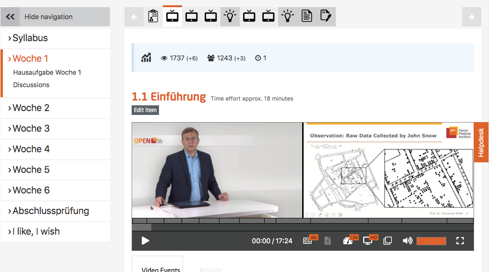
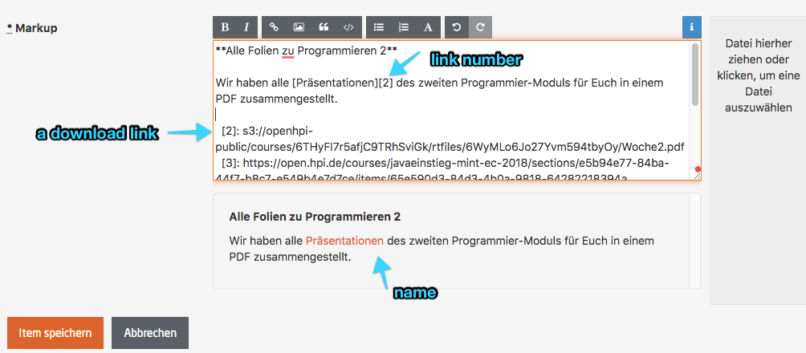
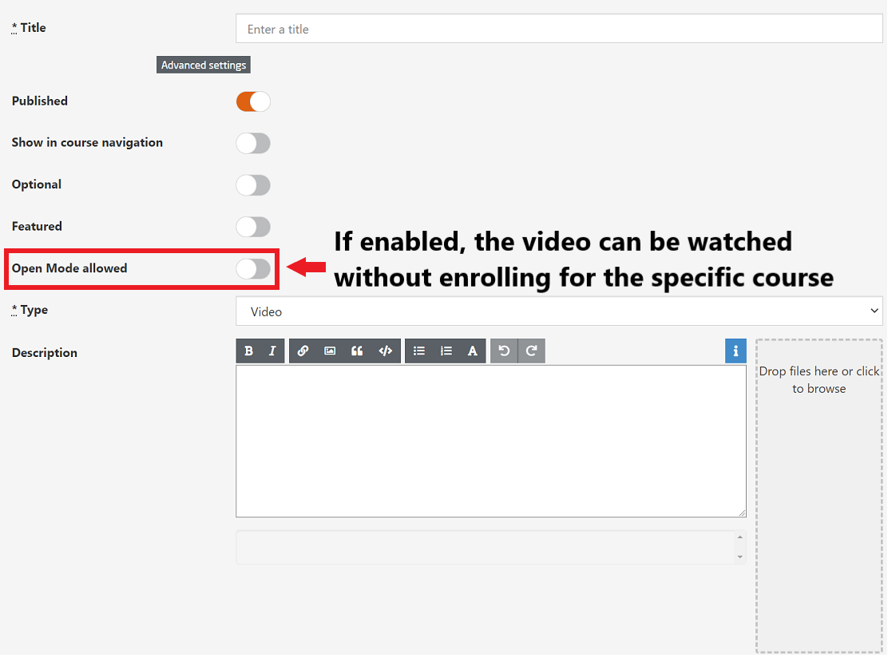
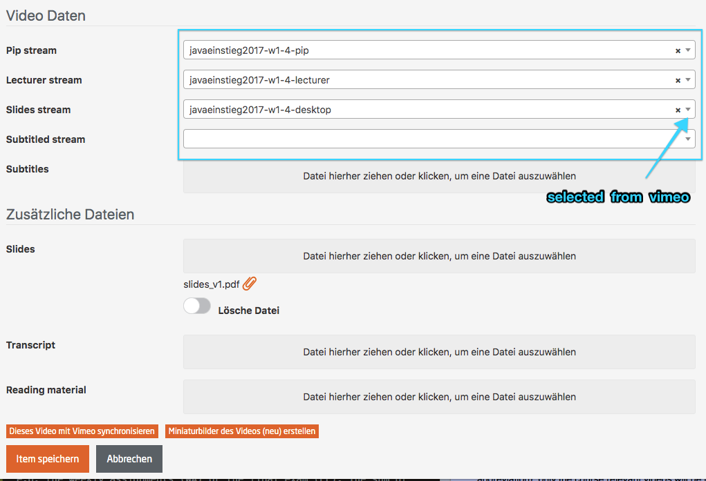
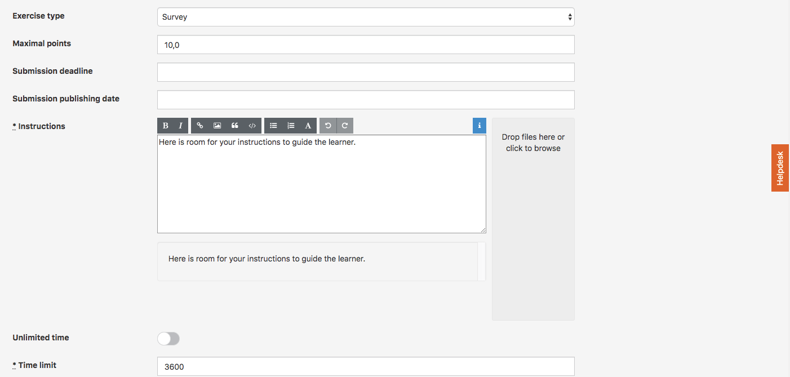
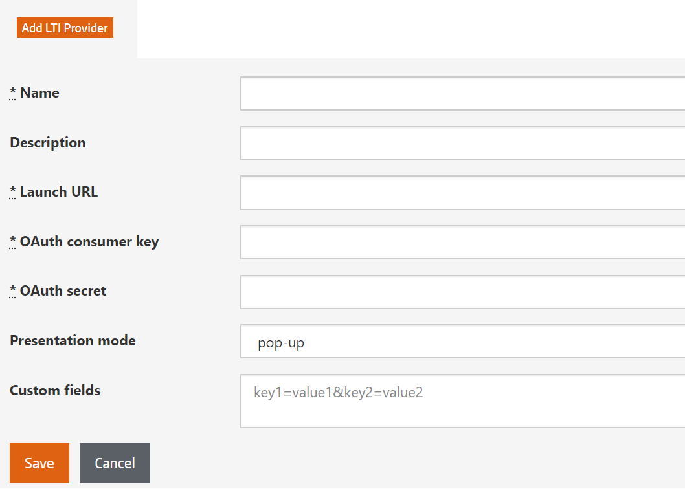

# Adding your content to the platform

## Preparation of course materials

We recommend to start with the preparation of the course materials at minimum 2 months (or earlier depending on the course structure) before course starts.

 The first task here is the design of the course outline.
 
## Recording of lecture videos in the studio
 
Tips from the camera crew:

-	Please start recordings well prepared. Slides should be prepared, if required talk them through.
-	Because of green screen background, please refrain from wearing green attire.
-	Please avoid finely checked clothing or with small patterns as they are not desirable for video recordings either.
-	Please look after your appearance, it should be well-groomed (keep in mind that several thousand people will watch your style.)
-	Due to the studio lights it can become quite warm in the recording room, so dress accordingly. 
- Ask your team to assist you during the recording.
- If you prepared speaker’s notes, then it should not be more than 1000 words or about 7 minutes worth of video.
- Look directly into the camera.
- Give your audience a smile.
- Put it as simply as possible.
- Speak at a decent pace and clearly.
- Use short sentences.
- Make sure to explain abbreviations and technical terms.
- At the end of the video stay in front of the camera for a moment and keep smiling (makes it easier for the media technicians to cut).

 
## Teaser and Course Introduction Video

It has proven in the past, that it makes sense to create a short video teaser, (apart from the course introduction video) This short teaser video shouldn’t be longer than 90 seconds. The teaser is used for marketing purposes, so try to include the following points as briefly as possible:  
- **Who?** - Short welcome and introduction of the course instructor
- **What?** - Title, format, duration, language of the course
- **Why?** - Facts, possible problems, deficits, challenges, mention the target audience

 The course introduction video will have a more detailed overview of course content, structure and perhaps the typical course cycle.
Both the videos should be published on YouTube or other video platforms and the registration link along with the teaser video should be shared in social media. The YouTube links should also be provided to your PR department.

*Fig. 01: course introduction video* 

## Teaching-Team – Person in charge as per week

The following tasks are required to be controlled by the teaching team:

- Organisation of content creation (e.g. timely recording and post production of videos, preparation of reading materials, etc.).
- Preparation and moderation of editorial meetings for the particular course week.
- Approval of weekly platform content as well as coordination of quality assurance.
- Coordination of fora and support during the course week (together with team leader).
This approach and procedure is not mandatory but it has proven worth in the past. 

## Setting the Course Content on the Platform

It is advisable to keep the surface of the course website clean and comprehensible for the learners.

### Course Structure

Each course consists of several modules or sections. In general these modules comprise 1 week of the course. They can, however, have arbitrary names and are not necessarily restricted to last exactly 1 week. A typical 6 week course structure could look like this:  
- Welcome (Optional, may also be included in Week 1)
  - Survey (Optional)
- Week 1
- Week 2
- Week 3
- Week 4
- Excursion
- Week 5
- Week 6
- Final Exam
- Survey (I like, I wish)

The platform team will create the course for you. Fill it with your content.  

  

*Fig. 02: an example of setion 1* 

 

*Fig. 03: an example of setion 6* 

 

*Fig. 04: an example of final exam and survey* 

The platform team will create the course for you. Fill it with content.

 

*Fig. 05: Course administration* => *Course structure and content*

### Add Section

  

*Fig. 06: Add section button*

  

A section generally contains a course week. It can also contain special purpose content, such as a Final Exam, an Excursion, or a Survey.

*Fig. 07-1: final exam and survey*  

*Fig. 07: Create section form*

  

**Title:** Could be something like Week 1, Excursion, or Final Exam. This will be visible for the user in the course's left hand navigation bar, the course syllabus, and the course content list on the course detail page.

**Description:** A short description of the section's content within one or two sentences. This will be visible for the user in the course syllabus, and the course content list on the course detail page.

**Published:** If the section is not published it will not be visible for the users at all.

**Start date:** Before the start date the section will be "greyed out" and locked for the users.

**End date:** Usually, an end date is not set for a section. Only use this if you have a well defined purpose or intention.

**Close discussions:** Discussions can be left open for 2 more weeks after the completion of the course. Later it can be closed for certain sections, if required. After closing, it is no longer possible to comment, answer, or start new threads.    

  

*Fig. 04: Successfully created section in course admin view*

  

### Add Item
Standard items are   
 - Video
 - Quiz
 - Text
 - External exercise tool
 - Peer Assessment  
 
Additionally, the platform supports [LTI items](http://www.imsglobal.org/lti/), which can be used to connect external tools to the platform. The platform also supports [peer assessments](todo://link).

 

*Fig. 08: LTI Providers*

  

*Fig. 05: Create new item form*

  

**Title:** The item's title.

**Start and end date:** When creating items, **DO NOT** set an end date if you don't have a really important reason to do so. Generally, it is also not necessary to set a start date.

**Published:** Only published items will be visible for the regular users.

**Show in course navigation:** Particularly important items can be shown in the left hand navigation. Please, use this scarcely.

*Fig. 09: Create new item form*

*Fig. 10: the type of items*  

#### Type Text

The provision of reading material can be generally carried out in three forms: 

 - directly as a text-page, 
 - as a PDF download, or 
 - as a web link

  

*Fig. 11: Create new text item form*

  
  

Text-pages can be formatted in markdown, it is possible to include images, weblinks, and links to files. 

Downloads can be provided directly through the platform. In those regions of the platform where this possibility exists, a data upload field is provided for this purpose.

Downloads and web links have to be linked from within a text page.

To link a file for download:

- Upload the file via the drop zone.
- Click on the add image icon and select the file that you have just uploaded.
- In the text field: remove the "!" in front of the link. And add some meaningful text within the brackets (see fig. 07.)

  

*Fig. 12: Manipulate image link to turn it into a download link*

#### Type Video

>The workflow of video production and post production, in terms of allocation of videos, can be carried out in different ways and therefore will not be discussed further in this document. Instead, we assume that you already have a produced video at hand, which you want to bring to the platform or you can take the assistance from the Medientechnik team.

**Integrating videos hosted on Vimeo:**
The integration for the Vimeo API from within the platform is sufficiently good. 
Basically there is a Vimeo Pro account that exists for the platform, from which videos are delivered. The streams can be uploaded from within the platform to Vimeo. See also [Uploading videos to Vimeo](https://vimeo.zendesk.com/hc/en-us/categories/201496018-Uploading-to-Vimeo).  
The filenames of the streams should begin with the course's course\_code. Please note that the system is case sensitive. As soon as one stream with the course\_code prefix is available, only those streams that start with the course\_code prefix will be listed in the dropdowns.
The platform's database is synchronized with Vimeo on a daily basis. See also below: [*Synchronize streams with vimeo*](https://github.com/openHPI/TeachingTeamGuidelines/blame/new_update_2020/docs/05_adding-content.md#L217)

**Integrating videos hosted by other providers:**
API support for other providers is currently not supported.
Admins (not teachers or teaching team members), however, can manually add video streams that are hosted with other providers. 

*Fig. 14: Add stream form (Administration => Videos)*

**Title:** The title of the streams should begin with the course's course\_code. Please note that the system operates case sensitive here. As soon as one stream with the course\_code prefix is available, only those streams that start with the course\_code prefix will be listed in the dropdowns.

**HD / SD URL:** The location where the respective strream can be found on the server.

**Width / Height:** The size of the video.

**Duration:** The length of the video.

**Poster-image URL:** Set a custom poster image (will be displayed before the video is started) for the video.

  

*Fig. 13: Create new video item form*

  

*Fig. 14: Add new video data*

**PIP stream, Lecturer stream, and Slides stream:**  
All videos can be integrated via a dropdown menu directly using the Vimeo API. In case the appropriate videos are named according to the specification above (name begins with abbreviation), only the course relevant videos will be listed in the dropdown menu. Videos that are not named in respect to this convention will not be listed. The platform must be synchronized with Vimeo once again, when a video's title has been changed there.

 - The steps listed above must be executed for the PIP stream (Picture in Picture) as well as the teacher and desktop stream, should all possibilities be offered.
 - It is possible to offer only the PIP stream if the videos have not been recorded with the tele-TASK system.
 - If all three streams are provided the PIP stream serves as a fall-back solution for devices that are not able to cope with our dual stream player.
 - PIP stream is useful specially for handheld devices like smartphone, tablet etc.

**Description:** When implementing video items on the openHPI Platform additional further information (such as introductory remarks or errata) can be added to the video on top or below the video items.

**Thumbnail archive:** This only applies if you have access to a full fledged tele-TASK system. In this case you also have access to web tool that generates these thumbnail archives.
 
**Subtitles:**  Can be provided in WebVTT format.

	WEBVTT

	00:00:03.500 --> 00:00:05.000
	Ein männlicher Briefmark erlebte

	00:00:06.000 --> 00:00:09.000
	Was Schönes, bevor er klebte.

	00:00:11.000 --> 00:00:14.000
	Er war von einer Prinzessin beleckt.
	
If subtitles are to be provided in multiple languages, all the filenames have to be extended with a short-form for the language:

	video-subtitles.vtt => video-subtitles.de.vtt
	
All the vtt files will have to be added to the same directory, which then can be zipped and uploaded here.  
Subtitles can also be generated from external agencies like poliTrans (MLLP) or Amazon (AWS) etc.

**Slides:** The slide sets can be provided as a PDF download, just like normal reading material. Slides to the videos should be added directly to the video item. Collected slide sets additionally can be made available to download on the 'materials' web page. For mobile apps, only the slides that have been provided with the video item will be included.

**Transcript:** A pdf with the transcript of the video content can be added here. It will be available for the users to download on the video page.

**Reading material:** You can add additional reading material in pdf format here.

**Audio:** For the optional provision of separate audio tracks for the videos. Audio streams can easily be produced with the ffmpeg tool. It is also available for download.

**Synchronize streams with Vimeo:** Streams are synchronized with Vimeo on a daily basis. If you want to add a Vimeo stream that has been uploaded to Vimeo more recently, you might have to synchronize the platform with Vimeo.

*Fig. 09: Create new video item form* 

### Type quiz

  

*Fig. 15: Create new quiz item form*

**Exercise type:** Select between *Self-test*, *Survey*, *Main*, and *Bonus*.
Self-tests are awarded with points, however, they are not counted into the final results at all. Quizzes of type *Main* are the weekly assignments (WA) or the final exam (FE). The sum of their points (plus possibly the points from peer assessments and practical exercises) constitutes the maximum of available points (MaxPoints) in the course. Quizzes of type *Bonus* are not summing up to the MaxPoints, but they can help to compensate points that have been lost in the *Main* assignments.

Example: 

- WA 1 (Main): 15 points
- WA 2 (Main): 15 points
- WA 3 (Main): 15 points
- Excursion (Bonus): 15 points
- FE (Main): 45 points

The participants can achieve a maximum of 90 points.

	User1:

	- WA 1 (Main): 7 points
	- WA 2 (Main): 8 points
	- WA 3 (Main): 6 points
	- Excursion (Bonus): 15 points
	- FE (Main): 35 points

	==> 71 points  

	User 2: 

	- WA 1 (Main): 15 points
	- WA 2 (Main): 15 points
	- WA 3 (Main): 15 points
	- Excursion (Bonus): 15 points
	- FE (Main): 45 points

	==> 90 points

*Surveys* are not rewarded with points, nevertheless, to avoid problems it is better to assign at least 1 point to a survey question. FreeText answers require that at least one answer (dummy) is provided, which needs to be marked as correct. Otherwise, the system will break. 

**Quizzes come with the optimal presets for their exercise type preselected. Change these settings only if you know exactly what you are doing.**

**Maximal points:** These are the maximal points that can be reached for this assignment. The value is read only and results from the sum of the points for the quizzes' questions 

**Submission deadline:** Set the deadline for the quiz. The deadline is hard. After this date it is no more possible to hand in a solution. The results of the participants are autosaved whenever something has changed. When the deadline has passed and the participant is still in the quiz, the results are automatically submitted and the quiz is closed. It is not possible to extend the deadline for single users. In [masquerade mode](todo://link) an admin can submit the quiz for a user even if the deadline has passed. 

**Submission publishing date:** The date when the results for the quiz will be published. Should be after the deadline. Should be set for *Main* and *Bonus* quizzes so that participants cannot spoiler the results in the forum. Self-tests, normally, do not have a deadline or a submission publishing date.

**Instructions:** These will be shown on the *quiz intro page*. The value is mandatory even is *Skip intro page* is on (see below.)

**Unlimited time / Time limit:** Self-tests and Surveys should be set to unlimited time, a good choice for a WA is a time limit of 1h, 2h for the FE.
This of course can be adjusted to your needs. If you e.g. want to make sure that participants can answer question by heart, reduce the time limit so that they have not enough time to look something up.

**Unlimited attempts / Allowed attempts:** *Self-tests* are provided with unlimited attempts, attempts for *Main* and *Bonus* exercises should be limited. *Surveys* need to be limited to one attempt.

*Fig. 16: Create new quiz* 

### Type external exercise tool
This option allows to add custom tools for practical exercises.
Any tool that supports the [Learning Tools Interoperability(LTI)](http://www.imsglobal.org/lti/) standard can be added here. 

  

*Fig. 16: Create new external exercise tool item form*

**Exercise type:** Can be *Self-test*, *Main*, and *Bonus*. Ignore the *Survey* option.

**Maximal points:** Set the maximal points for this exercise here. The LTI standard will return a result between 0 and 1 here. 

**Submission deadline:** See quiz.

**Submission publishing date:** See quiz.

**Instructions:** See quiz.

**LTI provider:** Select from the supported [LTI providers](todo://LTIProvider).

  

*Fig. 17: Select LTI provider*

  

*Fig. 18: Add new LTI provider*

**Optional exercise title:** ??

**Additional parameters for this exercise:** Some tool providers require additional parameters. These can be set here as key value pairs. Consult the tool providers documentation to see which parameters are required.

  

*Fig. 17: Create new exercise tools*

*Fig. 18: an example for using exercise tools* 

### Type peer assessment
Peer assessment provides the possibility to scale out exercises that can not be graded automatically.
Participants will be enabled to grade each others work.

You can find a general description of the Peer Assessment Feature [here](https://open.hpi.de/pages/p_a)
and an example for the calculation of grades [here](https://open.hpi.de/pages/p_a_grading).  

  

*Fig. 19: Create new peer assessment item form*

**Exercise type:** Can be *Self-test*, *Main*, and *Bonus*. Ignore the *Survey* option.

**New / existing assessment:** Existing peer assessments can be linked here so that they are accessible from different places. E.g. the submission phase (Week 1) of the assessment might be separated from the grading phase (Week 2).

*Fig. 18: edite a peer assessment* 
