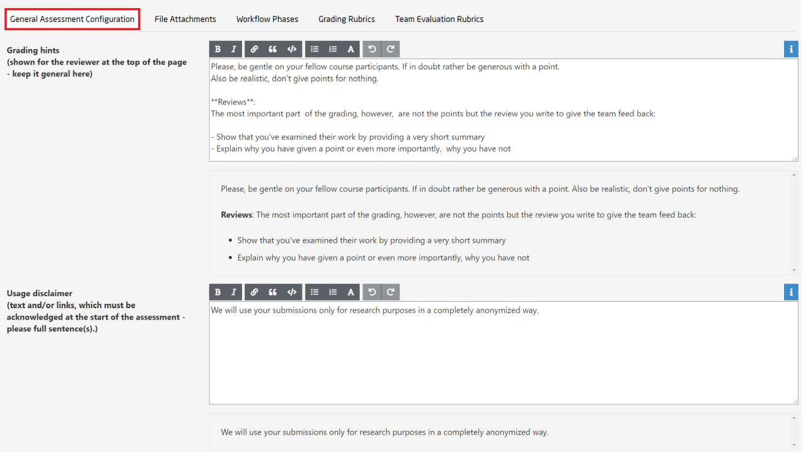
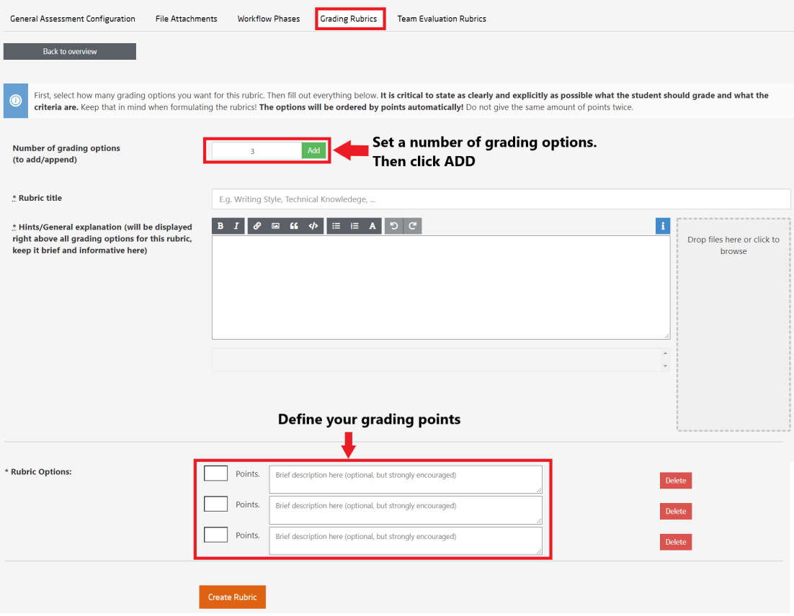
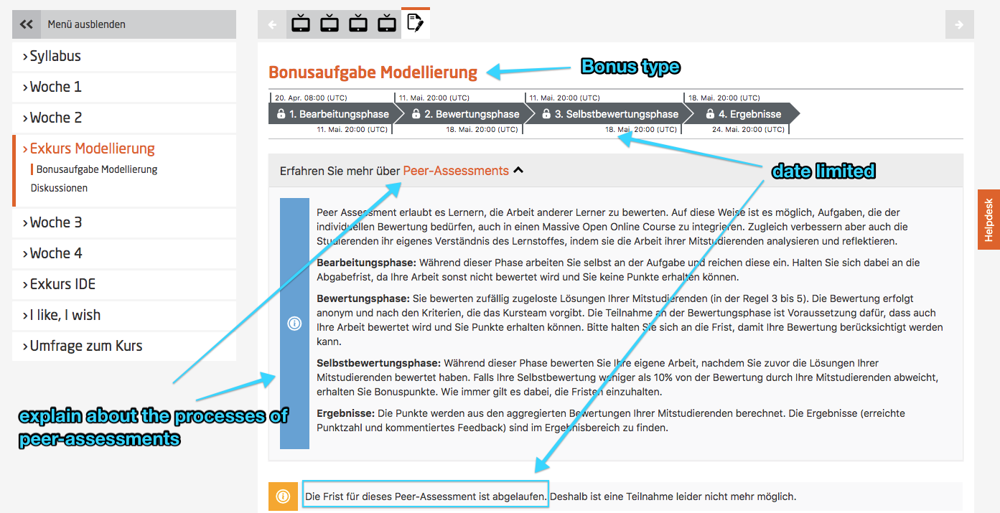
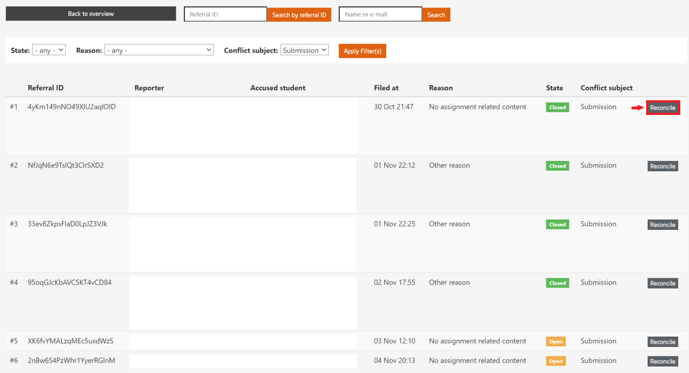

# Type peer assessment
Peer assessment provides the possibility to scale out exercises that can not be graded automatically.
Participants will be enabled to grade each others work.

You can find a general description of the Peer Assessment Feature [here](https://open.hpi.de/pages/p_a)
and an example for the calculation of grades [here](https://open.hpi.de/pages/p_a_grading).  

  
## Creating Peer Assessment  

To create a new peer assessment, go to **`Course Administration`** and select **`Course Structure & Content`**  

  
*Fig. First step for creating a new peer assessment*  
 

  
*Fig. Second step to create a new peer assessment*  
 

  
*Fig. Preview of the peer assessment template*
 

**Exercise type:** Set either ***Main*** or ***Bonus*** (Self test and Survey do not make sense here).  
Points for a peer assessment of type *Main* will be added to the amount of achievable points.  
Points for a peer assessment of type *Bonus* can be used to make up for regular points that have been missed. In this respect peer assessments behave just like standard quizzes. 

**New / existing assessment:** Existing peer assessments can be linked here so that they are accessible from different places. E.g. the submission phase (Week 1) of the assessment might be separated from the grading phase (Week 2). This feature is deprecated, however, and will be discontinued in the future. The recommended best practice is to set up the peer assessment in a separate section of the course.

## Peer assessment settings
To open the peer assessment dashbobard go to **`Course Administration`** and select **`Peer Assessment`**

  

*Fig. Peer assessment dashboard*  
 

### General settings  

  
*Fig. To edit the configuration of the created peer assessment*  
 

  
*Fig. To configure the general settings*  
 

While editing the general configuration, please follow the guidelines mentioned below:  

**Title:** The title of the assignment  

**Assignment instructions:** Describe what you expect the participants to do. Be as precise as possible. Particularly, in terms of what the participants will have to upload, file formats,etc.   

**Grading hints:** General information how the assignment will be graded.  

**Usage disclaimer:** If you want to use the work of the students outside of the actual assignment, you can ask the participants for their permission here.  

**Allow gallery opt-out:** Allow the students to opt-out their submission from being shown  in the best-of gallery. (Hint: If you allow this, the participants will expect that there is a best of gallery)  

**Allowed number of attachments:** Participants will be allowed to upload the specified number of files.  

**Maximum size of attachments:** Max. file size per file to be uploaded.  

**Allowed file types:** Comma separated list of allowed file types (endings)  

**Allow video upload:** Allow to upload videos to a specified video provider. Please, talk to the tech team before enabling this, as special measures have to be taken to make this work.  

**Video Provider Name:** The name of the video provider to be used  

**As team assessment:** It is optional  

### File Attachments

  
*Fig. Add files to the peer assessment*  
   

### Workflow Steps  

  
*Fig. Select the workflow steps for the peer assessment*  
   

### Grading Rubrics

*Fig. Add rubrics for the peer assessment*  
 

  
*Fig. An example of sample grading rubrics*  
   

### Team Evaluation Rubrics  

  
*Fig. Add team evaluation rubrics*  
   

### The Example for Peer Assessment

*Fig. Explain an example of peer assessment*

## Manage Peer Assessment Submissions  
  

  
*Fig. In this page, you can manage all the submitted peer assessments*  
   

## Peer Assessment Conflicts  
  
  
*Fig. In this page, you can see all the subject of conflicts reported by the reviewer*