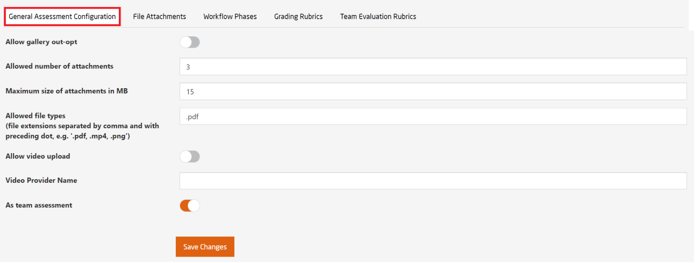
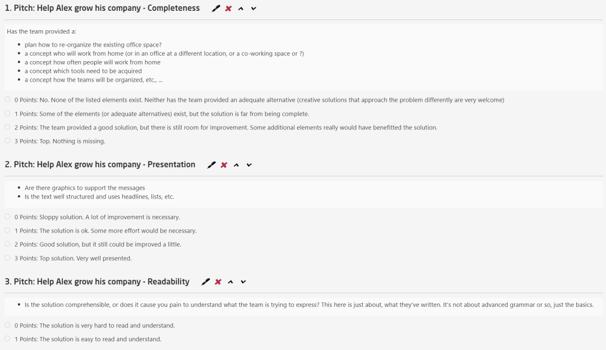
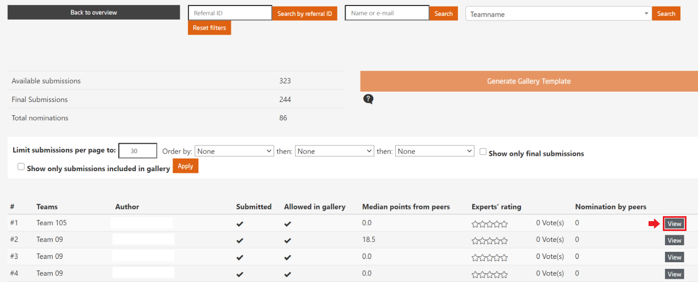
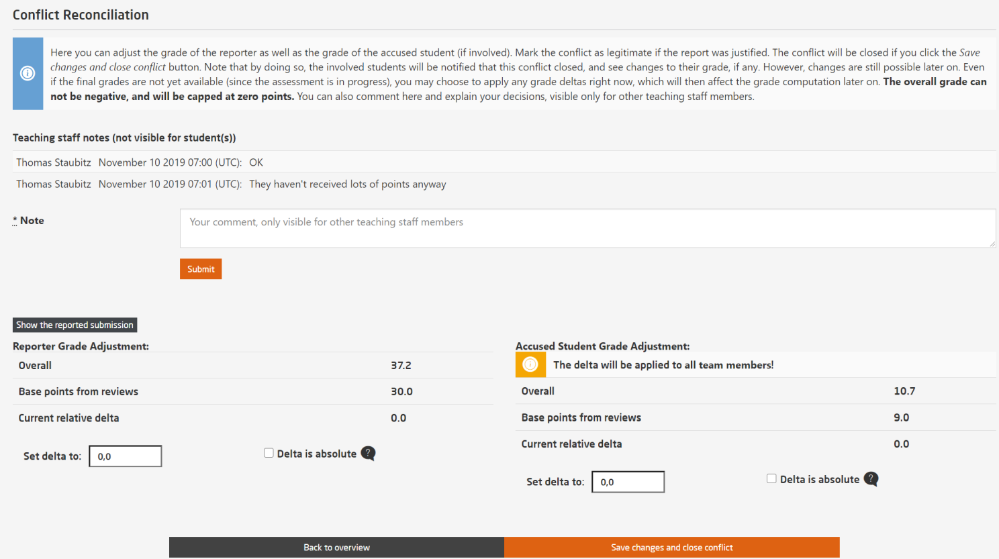

# Type peer assessment
Peer assessment provides the possibility to scale out exercises that can not be graded automatically.  
Participants will be enabled to grade each others work.  
It is important to note that peer assessments should be completed within the duration of the course, or that it is communicated very clearly upfront that participants might need some extra time to fully complete the exercise after the actual course has already finished.  
We also recommend to use peer assessments mainly as bonus exercises as otherwise the course completion rate might be lower.

Participants can find a general description of the Peer Assessment Feature [here](https://open.hpi.de/pages/p_a)
and an example for the calculation of grades [here](https://open.hpi.de/pages/p_a_grading).  

  
## Creating Peer Assessment  

To create a new peer assessment, go to **`Course Administration`** and select **`Course Structure & Content`**  

  
*Fig. First step for creating a new peer assessment*  
 

  
*Fig. Second step to create a new peer assessment*  
 

  
*Fig. Preview of the peer assessment template*
 

**Exercise type:** Set either ***Main*** or ***Bonus*** (Self test and Survey do not make sense here).  
Points for a peer assessment of type *Main* will be added to the amount of achievable points.  
Points for a peer assessment of type *Bonus* can be used to make up for regular points that have been missed. In this respect peer assessments behave just like standard quizzes. 

**New / existing assessment:** Existing peer assessments can be linked here so that they are accessible from different places. E.g. the submission phase (Week 1) of the assessment might be separated from the grading phase (Week 2). This feature is deprecated, however, and will be discontinued in the future. The recommended best practice is to set up the peer assessment in a separate section of the course.

## Peer assessment settings
To open the peer assessment dashboard go to **`Course Administration`** and select **`Peer Assessment`**  
  
*Fig. Select the Peer Assessment to modify the settings*  
   

### General settings  

  
*Fig. To edit the configuration of the created peer assessment*  
 

  
*Fig. To configure the general settings*  
 

While editing the general configuration, please follow the guidelines mentioned below:  

**Title:** The title of the assignment  

**Assignment instructions:** Describe what you expect the participants to do. Be as precise as possible. Particularly, in terms of what the participants will have to upload, file formats,etc.   

**Grading hints:** General information how the assignment will be graded.  

**Usage disclaimer:** If you want to use the work of the students outside of the actual assignment, you can ask the participants for their permission here.  

**Allow gallery opt-out:** Allow the students to opt-out their submission from being shown  in the best-of gallery. (Hint: If you allow this, the participants will expect that there is a best of gallery)  

**Allowed number of attachments:** Participants will be allowed to upload the specified number of files.  

**Maximum size of attachments:** Max. file size per file to be uploaded.  

**Allowed file types:** Comma separated list of allowed file types (endings)  

**Allow video upload:** Allow to upload videos to a specified video provider. Please, talk to the tech team before enabling this, as special measures have to be taken to make this work.  

**Video Provider Name:** The name of the video provider to be used.  

**As team assessment:**  Use this option if one team is reviewing another team's work.

   

### File Attachments  
Based on your choice of assignment, you may choose to upload files.   
Those files will be shown as assignment attachments and will be downloadable by the students.

  
*Fig. Add files to the peer assessment*  
   

### Workflow Steps  

  
*Fig. Select the workflow steps for the peer assessment*  
   
  
*Fig. Workflow steps*  
 

Each peer assessment always includes the following phases:  
* **Submit your work** - This is the first step where participants submit their assignment. Ideally, participants are allowed a minimum of **2 weeks** to hand in their submission.
* **Evaluate your peers** - This is the second step where participants can review their peer's work. You can set a minimum number of reviews to be made and participants can be allowed a minimum of **7 days** to submit their reviews.
* **Evaluate yourself** - This is not essential and can be left out. You can toggle the option button as per will.
* **View your results** - This is the final step where participants can view their reviewed results. The deadline for this step sets a time until which participants are able to report problems and rate their received reviews. Participants can award bonus points to its reviewer by rating the reviews.  

The unlock date of each phase determines when participants can start the next phase.  
If unlock date is not specified, participants can start the next phase as soon as they have completed the previous phase.  
The deadline for each phase is a mandatory field specifying a time for participants to complete the phase.

### Grading Rubrics  

You can define your own grading rubrics by following the illustration as shown below:  

  
*Fig. Define your grading rubric*  
   

First you need to select how many grading options you want for your grading rubric.  

*Fig. Add rubrics for the peer assessment*  
   

**Number of grading options**: You need to mention the number of grading criteria you desire  

**Rubric title**: Give a name to your custom defined rubric for future usage, for example, *completeness* , *presentation*, *readability* etc.  

**Hints/General explanation**: Give a brief explanation for each criteria for easy and transparent grading.  

**Rubric Options**: Define the grades for each criteria and set your grading scale    
   

  
*Fig. An example of sample grading rubrics*  
   

### Team Evaluation Rubrics  
If you have assigned a team for peer assessment then you have to define rubrics for team.  
By default there are three pre-defined rubrics in place.  
If you desire to create another rubric, please follow the illustration below:  

  
*Fig. Add team evaluation rubrics*  
   

## Manage Peer Assessment Submissions  

You can manage all the submitted reviews by following the below mentioned illustration:  

  

  
*Fig. In this page, you can manage all the submitted peer assessments*  
   

  
*Fig. View the submission and peer reviews along with your rating for the participant's work*  
   
  
*Fig. View the review details and facility for granting another attempt*  
   

To learn more about additional attempts and regrading, please visit [Additional Attempts](https://teachingteamguidelines.readthedocs.io/#courseadministration/peerassessmentmanagement/additionalattempts/) and [Conflicts & Regrading](https://teachingteamguidelines.readthedocs.io/#courseadministration/peerassessmentmanagement/conflicts/)  

## Peer Assessment Conflicts  
If any reviewer reports a complaint against the reviewed participant, you can manage the details and resolve the conflict by following the illustration:  

  
  
*Fig. In this page, you can see all conflicts reported by the reviewers and reviewed participants along with a brief subject mentioning the reason for conflict*  

For conflict reconciliation, click on **`Reconcile`** and you will be displayed the following page:  

  
*Fig. In this page, you see the details of the reported conflict along with the reviewer and reviewed participant(s).*  
   
  
*Fig. In the same page down below, the teaching team can add a note and in some cases adjust the grade to close the conflict.*  
   
If you choose to check the **Delta is absolute** box -  
* The grade will be set to a fixed amount of points
* Reviewer median and bonus points will be ignored  

If you choose to set a delta value, the points will be applied on top of the overall grade.
