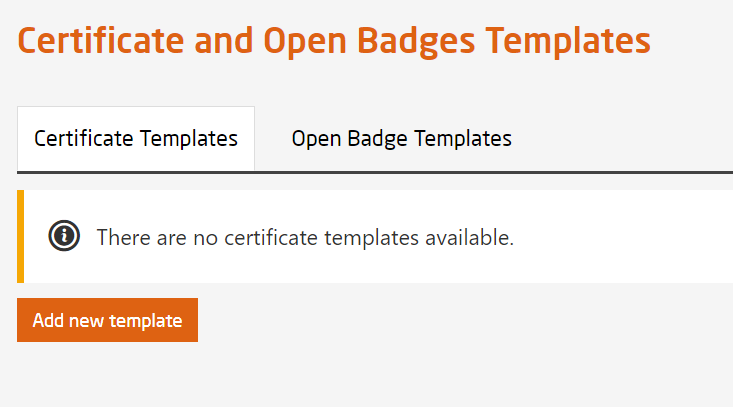

# Certificate Templates

Course administrators have the permission to create a new certificate template or edit an already prepared template.  

  
*Fig. To create or edit certificate template*  
<br>

  
*Fig. To add a new certificate template*  
<br>

  
*Fig. To create a new certificate template based on the certificate type of choice*  
<br>

Course administrator can add up to three different types of certificates:  

## Qualified Certificate:  
The template has to contain the following information -  
* Course title and summary
* Bullet points of most important course elements
* Signature of the course instructors and the person in charge of the platform
* Page 2: detailed course description
* Page 3: grading scheme

The following data is added dynamically by the platform -   
* Participant's name
* Participant's e-mail address
* Participant's verified picture (through automatic face recognition)
* Date of birth (optional)
* Credits earned
* Course performance (if you're among the top 5%, 10%, or 20% of participants)
* Anti-counterfeit link and QR code that allows e.g. employers to check if the certificate is genuine
* Date of issue: Current date


* The following XML snippet in the dynamic content box:

  ```xml
  <?xml version="1.0" encoding="utf-8"?>
  <!DOCTYPE svg PUBLIC "-//W3C//DTD SVG 1.1 Basic//EN" "http://www.w3.org/Graphics/SVG/1.1/DTD/svg11-basic.dtd">
  <svg version="1.1" baseProfile="basic" xmlns="http://www.w3.org/2000/svg" xmlns:xlink="http://www.w3.org/1999/xlink" x="0px"
    y="0px" width="595" height="842" viewBox="0 0 595 842" xml:space="preserve">
    <g id="Dynamic data">
      <text fill="#CF6828" stroke-width="0" x="258" y="130"  font-size="20" font-family="NeoSansMedium" text-anchor="left" xml:space="preserve">##NAME##</text>
      <text fill="#3B3939"  stroke-width="0" x="258" y="150"  font-size="12" font-family="NeoSans" text-anchor="left" xml:space="preserve">##EMAIL##</text>
      <text fill="#3B3939" stroke-width="0" x="258" y="170"  font-size="12" font-family="NeoSans" text-anchor="left" xml:space="preserve">##BIRTHDAY##</text>
      <text fill="#3B3939" stroke-width="0" x="265" y="548"  font-size="12" font-family="NeoSans" text-anchor="left" xml:space="preserve">##GRADE##</text>
                  <text fill="#3B3939"  stroke-width="0" x="265" y="572"  font-size="10" font-family="NeoSans" text-anchor="left" xml:space="preserve">##TOP##</text>
      <text fill="#3B3939" stroke="#3B3939" stroke-width="0" x="258" y="800"  font-size="9" font-family="NeoSans" text-anchor="left" xml:space="preserve">Potsdam, ##ISSUED_AT##</text>
  <text fill="#3B3939"  stroke-width="0" x="258" y="815"  font-size="7" font-family="NeoSans" text-anchor="left" xml:space="preserve">##VERIFY##</text>
    </g>
  </svg>
<br>  
  
Font types, positions need to be adjusted depending on the template.  

  
*Fig. Preview of Qualified Certificate*  
<br>

## Record of Achievement:  
The template has to contain the following information -  
* Course title and summary
* Bullet points of most important course elements
* Signature of the course instructors and the person in charge of the platform

The following data is added dynamically by the platform -   
* Participant's name
* Participant's e-mail address
* Participant's verified picture (through automatic face recognition)
* Date of birth (optional)
* Credits earned
* Course performance (if you're among the top 5%, 10%, or 20% of participants)
* Anti-counterfeit link and QR code that allows e.g. employers to check if the certificate is genuine
* Date of issue: Current date
  
* The following XML snippet in the dynamic content box:

  ```xml
  <?xml version="1.0" encoding="utf-8"?>
  <!DOCTYPE svg PUBLIC "-//W3C//DTD SVG 1.1 Basic//EN" "http://www.w3.org/Graphics/SVG/1.1/DTD/svg11-basic.dtd">
  <svg version="1.1" baseProfile="basic" xmlns="http://www.w3.org/2000/svg" xmlns:xlink="http://www.w3.org/1999/xlink" x="0px"
    y="0px" width="595" height="842" viewBox="0 0 595 842" xml:space="preserve">
    <g id="Dynamic data">
      <text fill="#CF6828" stroke-width="0" x="258" y="130"  font-size="20" font-family="NeoSansMedium" text-anchor="left" xml:space="preserve">##NAME##</text>
      <text fill="#3B3939"  stroke-width="0" x="258" y="150"  font-size="12" font-family="NeoSans" text-anchor="left" xml:space="preserve">##EMAIL##</text>
      <text fill="#3B3939" stroke-width="0" x="258" y="170"  font-size="12" font-family="NeoSans" text-anchor="left" xml:space="preserve">##BIRTHDAY##</text>
      <text fill="#3B3939" stroke-width="0" x="265" y="548"  font-size="12" font-family="NeoSans" text-anchor="left" xml:space="preserve">##GRADE##</text>
                  <text fill="#3B3939"  stroke-width="0" x="265" y="572"  font-size="10" font-family="NeoSans" text-anchor="left" xml:space="preserve">##TOP##</text>
      <text fill="#3B3939" stroke="#3B3939" stroke-width="0" x="258" y="800"  font-size="9" font-family="NeoSans" text-anchor="left" xml:space="preserve">Potsdam, ##ISSUED_AT##</text>
  <text fill="#3B3939"  stroke-width="0" x="258" y="815"  font-size="7" font-family="NeoSans" text-anchor="left" xml:space="preserve">##VERIFY##</text>
    </g>
  </svg>
<br>  

  
*Fig. Preview of Record of Achievement*  
<br>

## Confirmation of Participation:  
The template should contain the following information -  
* Course title and summary
* Bullet points of most important course elements
  
The following data is added dynamically by the platform -  
* Participant's name
* Participant's e-mail address
* Date of birth (optional)
* Course title and summary
* Current date
  
* The following XML snippet in the dynamic content box:
  
  ```xml
  <?xml version="1.0" encoding="utf-8"?>
  <!DOCTYPE svg PUBLIC "-//W3C//DTD SVG 1.1 Basic//EN" "http://www.w3.org/Graphics/SVG/1.1/DTD/svg11-basic.dtd">
  <svg version="1.1" baseProfile="basic" xmlns="http://www.w3.org/2000/svg" xmlns:xlink="http://www.w3.org/1999/xlink" x="0px"
    y="0px" width="595" height="842" viewBox="0 0 595 842" xml:space="preserve">
    <g id="Dynamic data">
  <text fill="#3B3939"  stroke-width="0" x="257.62" y="130"  font-size="20" font-family="NeoSansMedium" text-anchor="left" xml:space="preserve">##NAME##</text>
  <text fill="#3B3939"  stroke-width="0" x="257.62" y="150"  font-size="12" font-family="NeoSans" text-anchor="left" xml:space="preserve">##EMAIL##</text>
      <text fill="#3B3939" stroke-width="0" x="256.62" y="170"  font-size="12" font-family="NeoSans" text-anchor="left" xml:space="preserve">##BIRTHDAY##</text>
                  <text fill="#3B3939" stroke="#3B3939" stroke-width="0" x="258" y="800"  font-size="9" font-family="NeoSans" text-anchor="left" xml:space="preserve">Potsdam, ##ISSUED_AT##</text>
    </g>
  </svg>
<br>  

  
*Fig. Preview of Confirmation of Participation*  
