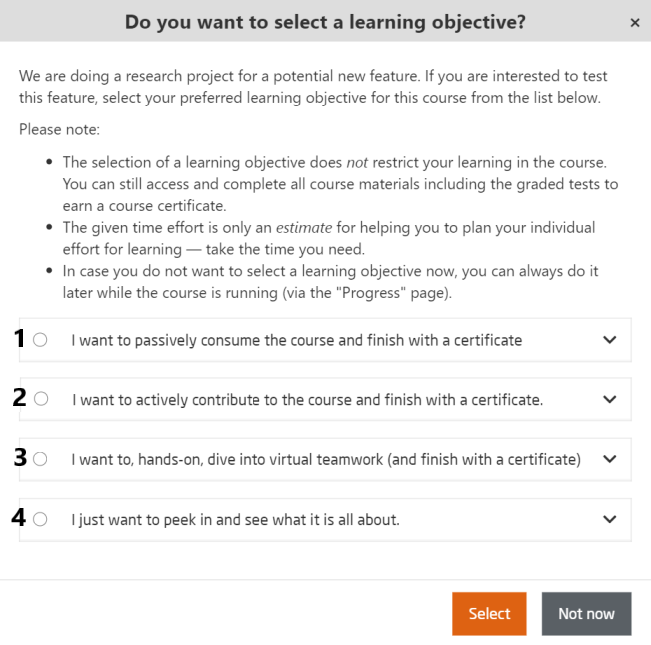

# Learning Objectives  

This is a new feature that openHPI team is currently working on to implement.  
This feature will allow the participant to set their preferred learning objectives and plan accordingly for an enrolled course.  
At the moment, it is still in the beta phase and participants can ignore if they do not desire to set an objective.  

Learning objective option can be accessed from the **`Progress`** page as shown below:  

  
*Fig. Select the learning objective to set your options*  
<br>  

  
*Fig. Available learning options for participants to choose*  
<br>

## Learning objectives in detail:
### 1. **I want to passively consume the course and finish with a certificate**:    

Participants have to 
* Watch the videos 
* Submit the self-tests and the final exam  

Participants do not have to 
* Contribute to (or at least follow) the triggered forum discussions 
* Participate in the team assignment
  
<br>  

```
Example:  

For a course with - 1 peer assessment, 39 quizzes, 12 reading materials and 37 videos: 

The estimated time would be set as follows - 
2 hours for 24 quizzes  
18 minutes for 4 readings  
6 hours 56 minutes for 34 videos
````  

### 2. **I want to actively contribute to the course and finish with a certificate**:  
Participants have to   
* Watch the videos
* Submit the quizzes 
* Actively contribute to the discussions on the triggered topics or at least follow them 

Participants do not have to 
* Participate in the team assignment

```
Example:  

For a course with - 1 peer assessment, 39 quizzes, 12 reading materials and 37 videos: 

The estimated time would be set as follows - 
4 hours 28 minutes for 38 quizzes  
18 minutes for 4 readings  
6 hours 56 minutes for 34 videos 
```  

### 3. **I want to, hands-on, dive into virtual teamwork (and finish with a certificate)**:  
Participants have to   
* Watch the videos
* Submit the quizzes 
* Actively contribute to the discussions on the triggered topics or at least follow them 
* Participate in the team assignment

```
Example:  

For a course with - 1 peer assessment, 39 quizzes, 12 reading materials and 37 videos: 

The estimated time would be set as follows - 
5 hours 58 minutes for 39 quizzes  
6 hours 57 minutes for 12 readings  
7 hours 32 minutes for 37 videos
1 hour for 1 peer assessment 
```  

### 4. **I just want to peek in and see what is all about**:  
Participants can do whatever they desire. If they have accessed 50% of the course material, they will be eligible for a Confirmation of Participation.