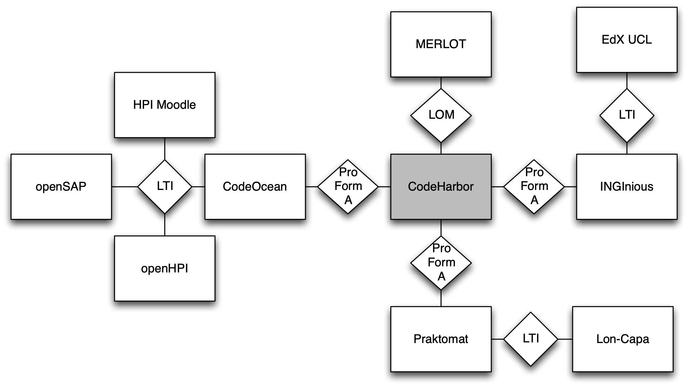

# CodeHarbor

Auto-gradable hands-on programming exercises are a key element for scalable programming courses. A variety of auto-graders already exist, however, creating suitable high-quality exercises in a sufficient amount is a very time-consuming and tedious task. One way to approach this problem is to enable the sharing of auto-gradable exercises between several interested parties. School-teachers, MOOC instructors, workshop providers, and university level teachers need programming exercises to provide their students with hands-on experience. Auto-gradability of these exercises is an important requirement. [CodeHarbor](https://codeharbor.openhpi.de) is a tool that enables the sharing of such exercises and addresses the various needs and requirements of the different stakeholders.

*Schematic view of the relation between LMS, auto-grader, and exercise repository*

### Availability

CodeHarbor is maintained by the openHPI team and available as an [open-source project on GitHub](https://github.com/openHPI/codeharbor). It is a standalone tool, decoupled from the HPI learning platform and hence not included by default. 

[CodeHarbor](https://codeharbor.openhpi.de) is hosted by the HPI and available as a central repository for the interested public.

Please refer to [our contact details](#further-assistance-and-contact) in order to get in touch and discuss more details, if you are interested in using or expanding the tool to fit your needs.

## Features

CodeHarbor provides the following features: 

1. **Interoperability and Data Exchange.** CodeHarbor is designed to allow data exchange between various, so-called auto-graders for programming assignments. In general, we can define auto-graders as software tools that help instructors to grade programming assignments of their students according to some predefined criteria. These predefined criteria need to be exercise-specific for their best learner support and usually consist of a series of unit tests. Based on interviews with different target groups (MOOC instructors, school teachers, and workshop providers), the main limitation of using auto-graders is the effort it takes to create exercises with proper unit tests. Hence, many interviewees wished for a central repository of available exercises ready for reusability. Based on the open-source, XML-based ProFormA format, which is being developed by the eCULT project for a very similar purpose to ours, CodeHarbor allows managing, importing and exporting programming exercises. As a part of their research for the ProFormA standard, [Strickroth et al.](http://nbn-resolving.de/urn:nbn:de:0009-5-41389) have analyzed many different grading tools to determine a common superset of the different requirements.  Sharing, cloning, and discussing and rating the exercises are some of the features provided by this repository. The option to share such exercises is not only important for teachers but is also well suited to reduce the overall workload for [instructors in MOOCs](https://ieeexplore.ieee.org/document/7851824) and universities.
2. **Rating and Commenting.** CodeHarbor allows its users to rate exercises for expressing their satisfaction with the quality of an exercise and recommending it to others. It allows users to filter for the content of proven quality. We are working with a 5-star rating system like the one that is used by Amazon. There is an ongoing discussion whether this system is too detailed or not. Other popular models are a simple binary "thumbs up, thumbs down" as it is used on YouTube, or a traffic light approach- green: good to go, yellow: slight improvements required, red: do not use without major rework. Users that mark a quiz with yellow or red must provide additional verbose comments. In addition to the rating system, we encourage the users to discuss the perceived flaws and to provide suggestions for improvement. This allows to establish communication between authors and consumers and to improve exercises in a collaborative effort.
3. **Shopping Carts and Collections.** CodeHarbor supports a “shopping cart” as a tool to collect a number of exercises and export it to an auto-grader in one sweep. A more persistent way of combining multiple exercises are the so-called "collections". Shopping carts can be turned into collections and collections can be added to a shopping cart for export. Collections remain after they are added to a shopping cart, while the shopping cart will be emptied after the export. Users can have several collections to persist different packages for different purposes, e.g. a set of exercises to train the concept of polymorphism or a set of exercises, e.g. to form a Python course.
4. **Exercise Versions, Forks, and Clones.** Versioning, forking, and cloning are key features for any kind of repository. CodeHarbor allows defining relationships between exercises, e.g. _Ex.2_ translates _Ex.1_ to another natural language or _Ex.3_ ports _Ex.1_ from C++ to Java. _Ex.4_ is an improved version of _Ex.2_, etc. Modeling these relationships enhances the probability to quickly find the right exercises for the given purpose.
   It will also become important to provide the possibility to trace the revision history of an exercise, reset it to an older revision, compare different revisions, and to track and merge changes once the users start to work on the material in a collaborative fashion.
   

*Possible location of CodeHarbor in a landscape of LMS’, MOOC platforms, and auto-graders.*

## Supported Languages

Design-wise, CodeHarbor is language-agnostic and suitable for all programming languages working with any form of files for data exchange or storage. The website uses the [ACE code editor](https://ace.c9.io) to enable syntax highlighting in more than 110 languages. CodeHarbor offers additional support for Java, Python, Ruby, and JavaScript and multi-language exercise descriptions in English, German, French, Spanish, Japanese, and Chinese.

## Further assistance and contact

CodeHarbor is provided as additional open source software and distributed independent of the HPI learning platform. If you have any questions about the usage of CodeHarbor, please get in touch via email. Developer-level issues and further documentation are available within the [GitHub repository](https://github.com/openHPI/codeharbor).

Contact: openhpi-info@hpi.de
