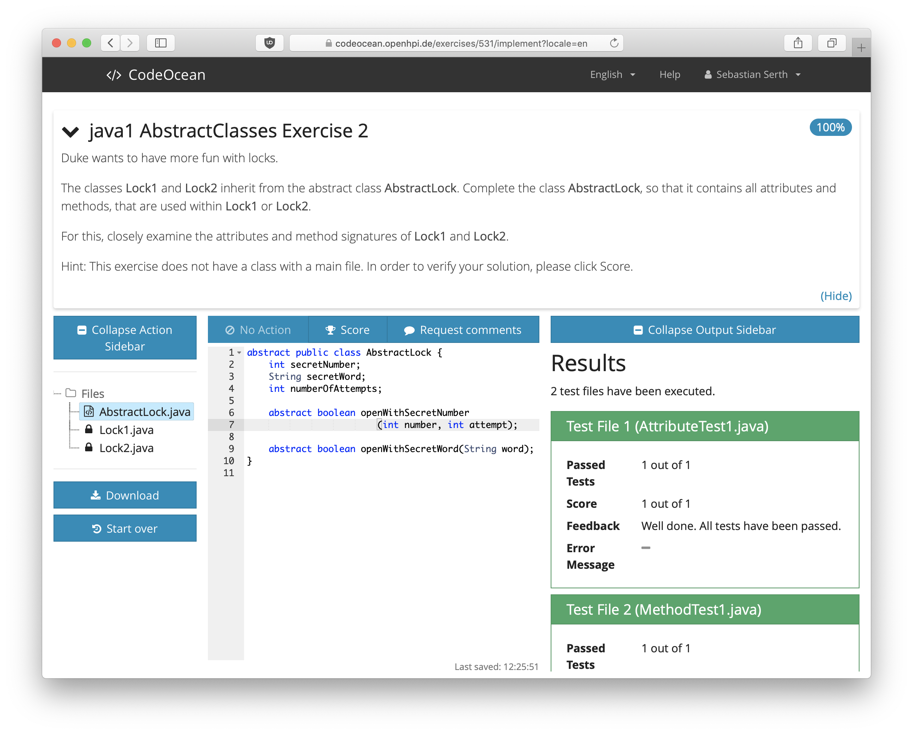

# CodeOcean

CodeOcean is an educational, web-based execution and development environment for practical programming exercises designed for the use in Massive Open Online Courses (MOOCs).

## Introduction 

Based on the [LTI](../../courseadministration/addcontent/learningunits/lti.md) standard, CodeOcean is a tool for the automated assessment of programming exercises. It allows learners to work on given programming assignments through a web-browser and gain points for tests specified by the teaching team. Users are able to edit the code, execute it remotely on the CodeOcean server, get feedback through unit tests, and ask fellow learners for assistance.

*Fig. CodeOcean implementation interface for learners*

### Availability

CodeOcean is maintained by the openHPI team and available as an [open-source project on GitHub](https://github.com/openHPI/codeocean). It is a standalone tool, decoupled from the HPI learning platform and hence not included by default. 

If you are interested in offering a course with practical programming exercises in CodeOcean, you might spin up your own CodeOcean server and include exercises as outlined in the [LTI](../../courseadministration/addcontent/learningunits/lti.md) documentation. Further documentation of CodeOcean incl. the requirements for server-side setup are included in the [CodeOcean repository](https://github.com/openHPI/codeocean). 

In addition to setting up an own instance of CodeOcean, we also offer to set up a managed CodeOcean instance specifically for your needs based on our multi-year experience with over 150.000 user enrollments. Please refer to [our contact details](#further-assistance-and-contact) in order to get in touch and discuss details.

## Advantages

CodeOcean has many advantages for learners and teachers alike: 

1. CodeOcean offers a predefined view on the exercises with scaffolded source code including syntax highlighting and allows editing these files directly within the browser.
2. The platform allows executing the code on the server and streams the output back to the learner’s web browser. Together with the customized view, learners are supported to get up with the programming in no time instead of taking care of the development environment. Learners do not need to download and install any compiler or runtime. Thus, MOOC instructors minimize technical help requests about correct machine setup and can focus forum posts on the content provided in the course.
3. CodeOcean includes unit tests to provide feedback for learners and score their code. A unit test is defined as a program that either runs the learner’s code in a pre-defined way and compares the provided result with an expectation or the unit test parses the student’s source code and matches it against an exercise-defined string. While the code of the unit test is hidden, learners can run the unit tests at any time and get instant feedback on whether they passed or failed. If the unit tests fail the result is shown together with an error message defined by the MOOC instructors. On the one hand, this feedback helps learners to help themselves and provides them with a hint helping them to correct their code. On the other hand, automated scoring using unit tests is required to indicate progress for the learners. In the context of a MOOC with thousands of active learners, a manual review by the instructors is not feasible and peer-review of source code has not been implemented in CodeOcean so far.
4. In CodeOcean, learners can ask questions about their program directly within the platform and in the context of their current program. Usually, MOOC platforms provide a forum to discuss questions. While this concept also works great for source code in general outside of a MOOC (cf. [StackOverflow](https://stackoverflow.com)), it is an additional barrier for novices to summarize their problem externally. To understand the problem, contextual information is generally of help for others to provide the current solution. When using a dedicated forum, learners are required to provide as much information as necessary to reproduce the issue which beginners might find difficult to identify. As a result, they might copy too few or too much information. In addition, learners regularly do not format their source code appropriately in forum posts (but as plain text), making it difficult to read. With Request for Comments, CodeOcean provides a built-in feature to ask a question in the context of an exercise, thus lowering the barriers to getting help. CodeOcean presents the learner’s source code and error message together with the question to fellow students and allows them to add a comment specifically to one line of code. Hence, the previously described issue is solved with a dedicated forum.

## Supported Languages

CodeOcean runs arbitrary user code in predefined Docker containers and thus supports a variety of different languages. So far, it has been mainly used for Java, Python, and Ruby at openHPI.de but also supports R, Node.js, and Raspberry Pi setups. Additional languages and frameworks can be added as a Docker image without changing the overall CodeOcean architecture.

## Further assistance and contact

CodeOcean is provided as additional open source software and distributed independent of the HPI learning platform. If you have any questions about the usage of CodeOcean, please get in touch via email. Developer-level issues and further documentation are available within the [GitHub repository](https://github.com/openHPI/codeocean).

Contact: openhpi-info@hpi.de

### Demo Courses

The following public courses used CodeOcean for exercises and graded exams. Feel free to try any of these to get an impression of the system.

In German:

- [Objektorientierte Programmierung in Java](https://open.hpi.de/courses/javaeinstieg2020)
- [Programmieren lernen mit Python](https://open.hpi.de/courses/pythonjunior2020)
- [Programmieren mit Ruby](https://open.hpi.de/courses/ruby2018)

In English:

- [Object-Oriented Programming in Java](https://open.sap.com/courses/java1)
