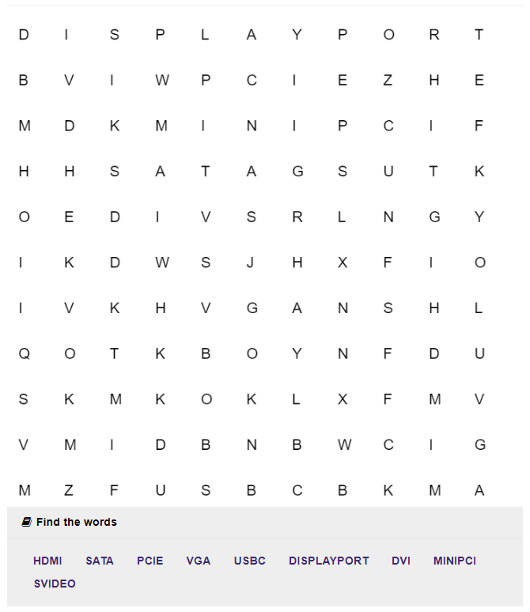
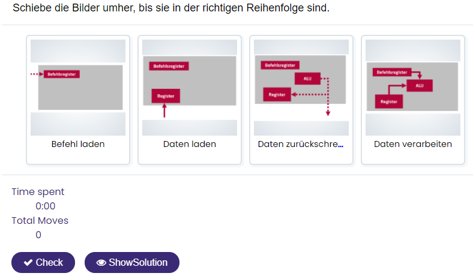

# H5P 

H5P is...

## Introduction

h5p.org
can only be used for fun 

### Availability

## How to use it
**(Lti provider anlegen)**
**Add the H5P Dummy to the course (placeholder on how to do that)**. Then execute the dummy task. You should see the Course Library. This is the section where you manage the h5p content for your course. You can create new content with the button on the top. Next select the desired type on content. This is also the place where you can upload h5p content if you downloaded it. Once you selected the the content you can fill it in any way you like. For the quizzes there are two sections on the bottom where you can set speciffic feedback for score ranges or the behavioural setting of the quiz. This allows you to define penalties, retrys and other visual behaviour of the task. Once the content is created you have to save the item. Now you will see the item as it is display for the participants of the course. Additionally you can see a box at the bottom that looks similar to this one:  
The last line e.g. _exercise=60074a88a0e7742300b91a6d_ is the parameter which you have to enter on the create quiz site on open.hpi. You have to set the Lti provider as well. An example looks like this:  

## Content of H5P

It is possible to use H5P for a variety of use cases. As an example it can be used to display data and display interactive quizzes. The following quizzes are examples that have been used in the computeranatomie course. 

1. **Memory** You can either set the pictures to be the same or the match different pictures. In the first case the participant will have to find pairs. In the second case the participant has to find matching pictures. As long as the participant completes the memory game, full points will be rewarded. An example looks like this:  
2. **Find the words** In this quiz you can define a list of words that will be hidden in a field of letters. This will be done automatically. The words will appear in any possible way and direction in the letter field. It is possible for a word to be backwards diagonal. There are no penalties so the full points will be rewarded for finding all words. An example:  
3. **Drag and Drop** In this quiz the participants drop words either on marked areas over a picture or in question fields. They are not as easy to set up as the others. However it is more flexible than the other quizzes. It is possible to define which words can be dropped into which zones. Additionally the number of words per zone can be set as well. This makes the following examples possible:    
4. **Image Sequencing** This quiz allows you to set pictures in a correcter order. In will then mix them up for the participants. This is easy to set up and use. The example from the course looks like this:  

## Current problems with the tool

## Feedbacks from the users

----------
This is not part of the openHPI platform.

The H5P Wrapper is an open source tool.

TODO add basic information about functionality and link to github repository.

Details are to be discussed. 
Contact: openhpi-info@hpi.de

