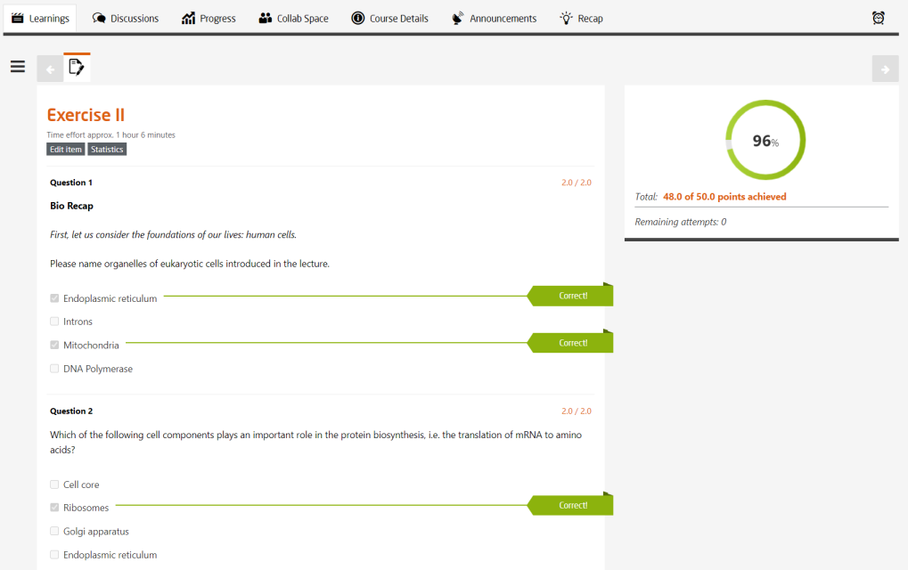
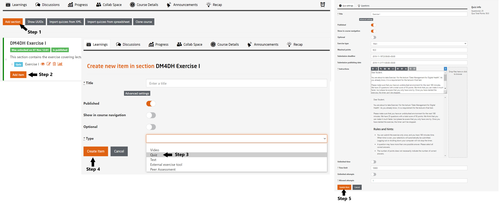
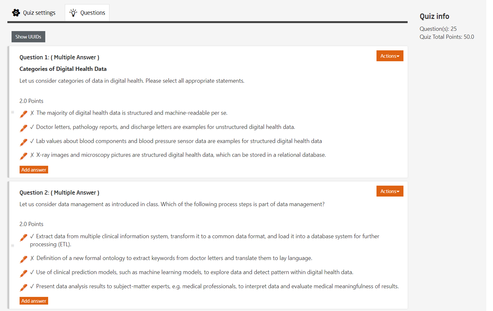

# Quiz

A quiz consists of questions and the corresponding answers. The points to be awarded are configured per question. Additional explanatory texts may be added to the questions and answers. The answer options are marked as correct or wrong by the teaching team behind the scenes. Answers to a question can be configured to be shown in random order.  

To learn more about creating and configuring quizzes, please refer to [Quiz Design](https://teachingteamguidelines.readthedocs.io/#bestpractices/quizdesign/)  
   

  

*Fig. Sample preview of a quiz*
 

So far there are four different types of questions to choose from:  

* Multiple choice questions (ONLY ONE correct answer) 
* Multiple answer questions (MORE THAN ONE possible correct answers)
* Free-text questions (with a configurable list of correct answers) 
* Essay questions (not evaluated automatically)

With the exception of essay questions, the evaluation of quizzes is a fully automatic operation. The evaluation for automatically graded questions are listed below with an example:  

* ### Multiple Choice Question:  
    There is only one correct answer.  
    For the correct answer, the specified number of points for the task will be awarded.  
    The participant receives 0 points for an incorrect answer.   

* ### Multiple Answer Question:   
    There are more than one possible answers.  
    The maximum number of points possible is divided by the number of correct alternatives.
    The resulting value is used as the base value.  
    For every correctly chosen alternative, the base value is given.  
    For every incorrectly chosen alternative, the base value is deducted.  
    If the total result is negative, then 0 points are given.  

    >**Example**:  
    A maximum of ***3*** points are given for a task. ***3*** answers out of ***5*** are correct.  
    The participant has marked ***2*** answers correctly and ***1*** incorrectly.  
    The participant gets ***1*** point each for the two correct answers (3 divided by 3). ***1*** point is deducted for the wrong answer.  
    The participant therefore gets a total of ***1*** point for the task.  

 

The platform provides a user interface to create quizzes. Alternatively, quizzes can be imported from Google Spreadsheets and via an XML import format. Please contact your platform administrator for further instructions to work with the import formats. 

As all item types, quizzes in a course are located within a course section.

*Fig. Sample preview of the user interface to create quizzes*

*Fig. Steps to create quiz for a course module*

*Fig. Sample preview of a question list for the quiz*

Despite the quality control and great care taken in creating the tests, the possibility of errors or ambiguities cannot be wholly eliminated. If for some reason an error has slipped into one of the questions, there are different ways of re-grading it:  

* Re-grading scripts can be used to regenerate point calculation for all participants.
* It is also possible to credit individual participants with points. 
* Before expiration of the deadline, extra attempts can be activated individually on a per participant basis.

The following re-grading options are supported by the HPI platform:   

* ### Multiple Correct Answers for Multiple Choice Questions:  
    In multiple choice questions, additional answers can be marked as correct after the fact.  
    All participants who have selected one of the newly marked correct answers will receive the full number of points.  

* ### Removing an Answer: 
    In multiple answer questions, both correct and incorrect answers can be removed at a later date.  
    The points are then re-calculated for all participants.  
    It is possible that some participants will end up with fewer points than before the re-grading.

    >**Example**:  
    One of the wrong answers given was ambiguously formulated.

* ### Choosing One Answer for all Participants: 
    Here one specific answer is chosen for all participants.  
    The points are then recalculated.  
    Afterwards, all participants involved will have more points.  

    >**Example**:  
    One of the answers given as correct was formulated ambiguously.  
    Some participants decided to play it safe and chose not to select the answer.

* ### Adding an Answer: 
    Other correct answers can be added at a later date for free-text questions.  

    >**Example**:  
    This question asks for the solution of the calculation:  **2 + 2**.  
    The answer expected would be ***4***.  
    Some participants have written ***4*** and others - ***The solution is 4***

* ### Jackpot:
    All participants who answered a question in some way get the full number of points.  
    Alternatively, the full number of points could be given to all participants who took the test but did not answer that particular question.  

    >**Example**:  
    When none of the other mechanisms apply. 
    
Please contact your platform administrator if you have to regrade on of your quizzes.
  
 

A quiz can be used as a self-test or a graded test:  

* In the self-checking function, the correct answers are displayed immediately after the self-test has been completed.  
  
* In the case of the graded test, the results are time-delayed following expiration of the set publication date to prevent discussions from occurring too early.  

Furthermore, quizzes can be defined as a bonus exercise. In this case, the quiz is similar to a graded quiz except that the points earned are only used to make up for missing points on other quizzes.

>**Example**:  
>
>Course duration: 6 weeks  
One weekly evaluated task: worth *15* points each  
One final test: *90* points  
One bonus task: *10* points  
Approx. 30 self-tests: worth *4* points each (*120* points total) 
>
>
>Maximum possible points in the course: ***[(6 x 15) 90 + 90]*** = ***180*** points  
>The *120* possible points from the self-tests do not generally count in the evaluation.
>
>**Participant #1**   
Participant misses the first week after learning too late about the course  
In the following weeks and on the final test, the participant achieves the maximum number of points  
Participant also achieves the maximum *10* points on the bonus task  
>
>**Result**:  
***(5 x 15) + 90 + 10*** = ***175*** points  
>
>
>**Participant #2**  
Participant earns the total number of possible points every week and on the final test  
Participant also achieves the maximum *10* points on the bonus task  
>
>**Result**:  
***(6 x 15) + 90 + 10*** = ***190*** points.  
The result is capped at the maximum achievable ***180*** points 
>
>For both participants, the points scored on the self-test have no bearing on the result.

 

It is possible for participants to be proctored online while they are taking the graded test.   
The participant needs a webcam for this to be possible. Online supervision is based on facial recognition and used to determine if the participant taking the test is actually the same person who registered for it.  
Whether the participant is using additional materials is not checked.